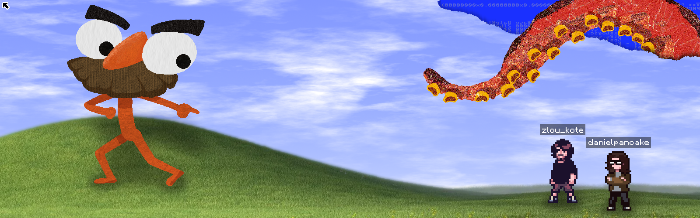

<!-- This structure is heavily inspired by YellowAfterlife -->

Hi! I'm `danielpancake`, a software and game developer 🫡

I create assets, systems, and games with GameMaker; build software with Rust or Tauri; and explore things like web design, data science, and functional programming

- [GameMaker Things](https://github.com/gml-assets)  
  Collection of GameMaker tools, libraries, and assets
- [Games](https://github.com/danielpancake-games)  
  Some of my open-sourced actual games

Other repos are [`here`](https://github.com/danielpancake?tab=repositories) but have yet to be categorized...

 

<table align="center">
  <tr>
    <td>
      <b>Inner monologue</b> &nbsp;&nbsp;&nbsp; [ _ ][ □ ][ × ]
    </td>
  </tr>

  <tr>
    <td>
      

        
      

      

        
      

      

        
      

      

        
      

      

        
         
        <b>Read</b> 11:30 AM
      

    </td>
  </tr>
</table>

  <a href="https://danielpancake.github.io"><code>danielpancake.github.io</code></a>

